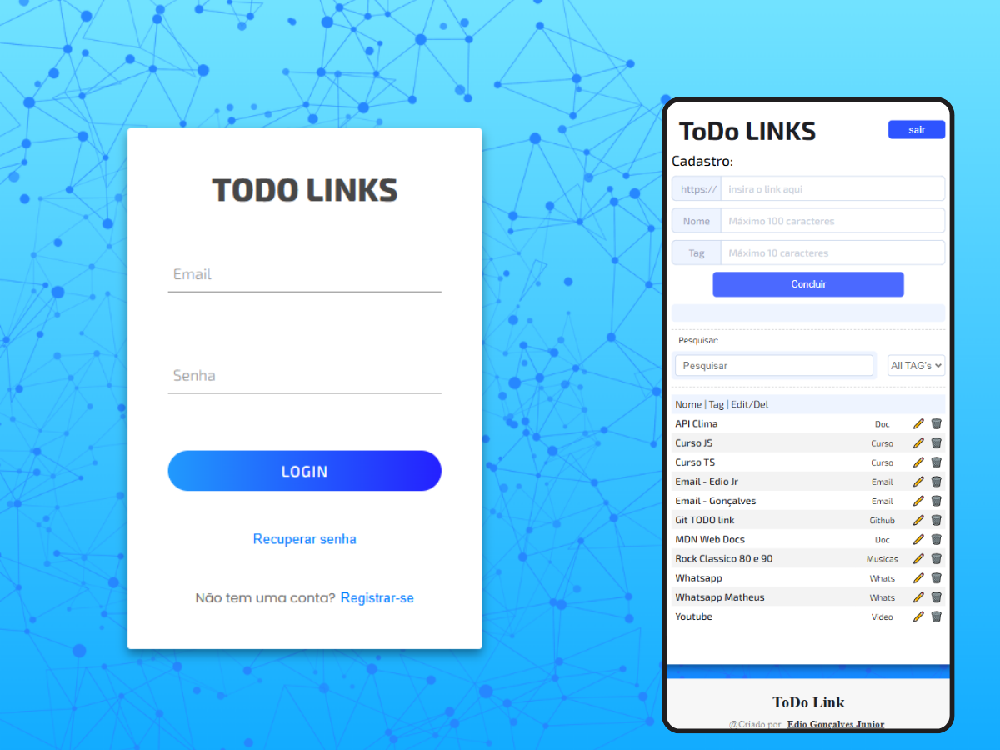

# Aplicação Web de Todo com Links Personalizados

Este repositório contém o código-fonte de uma aplicação web de gerenciamento de links, que permite aos usuários adicionar links personalizados, associar tags e descrições, além de editar e gerenciar esses links. A autenticação de usuários é realizada via **Firebase**.

## Tecnologias Utilizadas

- **HTML5**: Para estruturar semanticamente a aplicação.
- **CSS3/SASS**: Para estilização avançada e organização modular do CSS.
- **JavaScript**: Para a lógica da aplicação, manipulação do DOM e funcionalidades interativas.
- **Firebase**: Para autenticação de usuários e armazenamento de dados em tempo real.

## Funcionalidades

- **Autenticação com Firebase**: Os usuários podem se registrar e fazer login para gerenciar seus links personalizados.
- **Adicionar Links Personalizados**: O usuário pode adicionar um link com uma descrição e associar tags.
- **Edição e Remoção de Links**: Os links adicionados podem ser editados ou removidos facilmente.
- **Gerenciamento de Tags**: O usuário pode associar tags aos links para categorizá-los e efetuar pesquisas.
- **Layout Responsivo**: A interface se adapta a diferentes tamanhos de tela, de dispositivos móveis a desktops.

## Design e Interface

A interface foi projetada com um foco em usabilidade, simplicidade e eficiência, proporcionando uma experiência de usuário intuitiva. A estilização foi realizada com **SASS**, permitindo uma organização modular e reutilizável do CSS.



## Como Executar o Projeto

### Pré-requisitos

- Conta no [Firebase](https://firebase.google.com/).
- Clonar este repositório.

### Passos

1. Clone este repositório:

```bash
git clone https://github.com/Edio-Goncalves/todo-links
```

2. Navegue até o diretório do projeto:

```bash
cd todo-links
```

3. Abra o arquivo `index.html` no seu navegador preferido para visualizar a aplicação.
